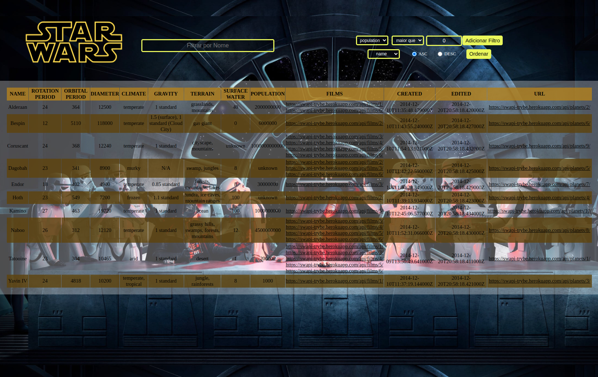

## BEM VINDO AO REPOSITÓRIO DO PROJETO STARWARS PLANET SEARCH
---

# Visualização do Projeto

---

# Introdução

Você por acaso é fã de StarWars como eu? Se sim trago um projeto muito interessante que utilizei para exercitar meu conhecimento no framework que (atualmente) é o meu preferido! :rocket:

O projeto tem como intuito exibir uma lista de planetas, que foram citados/visitados na franquia, resgatando-os de uma API desenvolvida pela @Trybe, e então desenvolver a utilização de filtros baseado nas informações contidas.

---

# HABILIDADES

Neste projeto utilizei as seguintes técnicas:

- Context API do React para gerenciar os estados;
- React Hooks como useState, useEffect & useContext;
- E claro, a criação de Custom Hooks;

---

- Instale as dependências:
  * `npm install`

- Inicialize a aplicação:
  * `npm start`
